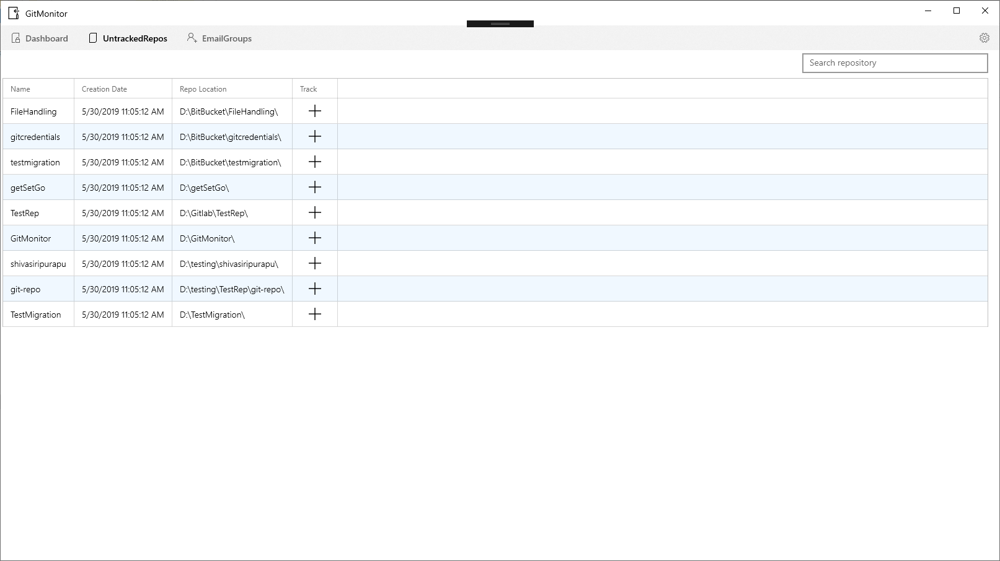
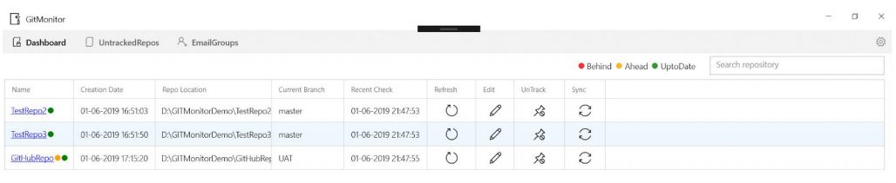
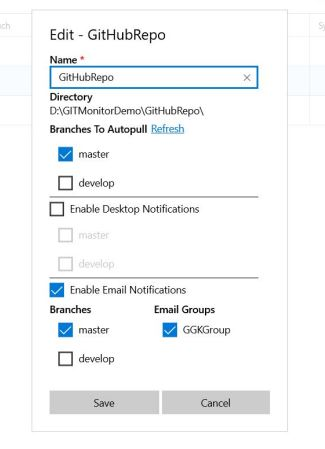
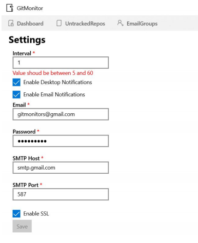

# GitMonitor

Welcome to GitMonitor! GitMonitor is an application designed to make your life easier by managing your repositories for you. GitMonitor tracks statuses of repositories on your machine and notifies you when your branches have commits to pull from a remote repository.

## AutoPull
To make things even simpler, GitMonitor offers an **AutoPull** feature, which when enabled performs a pull operation on the selected branches whenever new commits are available in the remote repository.

## How It Works
GitMonitor uses a watcher service to look for when a new repository is created in the file system and this is directly added to your **Untracked Repos** section in the application.
>

### Untracked Repos

Once you find your repository in this section, you can choose to start tracking this repository by clicking the "**+**" icon in the row corresponding to your repository.

### Dashboard Page

>

Once you setup the repositories to be tracked, you can see them on the **Dashboard** page. This page contains information regarding the Repository location and branch statuses. Every repository has, next to its name a status indicator, which tells you the status of your repository. 

- A <i class="circle green fas fa-circle">green</i> indicator implies that your repository is up to date.
- A <i class="circle red">red</i> indicator implies that your repository is behind, meaning there are commits in a remote branch that you need to pull.
- A <i class="circle yellow">yellow</i> indicator implies that your repository is ahead, meaning you have commits on your local machine that are yet to be pushed to the remote repository.

Once you click on the name of your repository, it opens up a popup and shows you the statuses of all your branches broken down into ahead and behind in comparison to your remote.

You can hit the **refresh** button to refresh the status of your repository and see latest updates.

The **sync** button helps you pull any commits on the remote to your local if you are behind, **even if autopull is not set-up**.

From this page, you can also open up your repository in the File Explorer or and IDE with the single click of a corresponding button.

You can stop tracking a repository by clicking the **untrack** button. You can find this repository on the **untracked repos** page if you wish to start tracking it again.

### Edit Repository Settings

You can configure whether you need notifications and email notifications to be sent when there are updates in on a particular branch in a particular repository through the "Edit Repoository" page accessed by clicking  "Edit" icon on the **Dashboard** page.

>

When on this page, you can also select email groups that should receive the notifications for these updates. Email groups can be setup and managed from the **Email Groups** tab. 

### Settings
>

This page can be accessed by clicking on the "gear" icon in the top right corner. Here, you can set the following:
- **Interval** (frequency) at which the service that keeps your tracked respositories up to date. The Interval fields accepts a numeric between 5 - 60 which is repesentative of the number of minutes after which the service will run.
- Turn on/off **Desktop notifications** across the application
- Turn on/off **Email notifications** across the application
- **SMTP configuration** for sending email notifications

