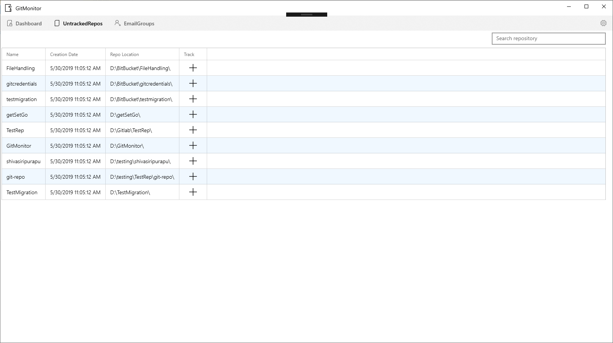

# GitMonitor

Welcome to GitMonitor! GitMonitor is an application designed to make your life easier by managing your repositories for you. GitMonitor tracks statuses of repositories on your machine and notifies you when your branches have commits to pull from a remote repository.

## AutoPull
To make things even simpler, GitMonitor offers an **AutoPull** feature, which when enabled performs a pull operation on the selected branches when new commits are available in the remote repository.

## How It Works
GitMonitor uses a watcher service to look for when a new repository is created in the file system and this is directly added to your **Untracked Repos** section in the application.

>

Once you find your repository in this section, you can choose to start tracking this repository by clicking the "**+**" icon in the row corresponding to your repository.
